# Onukonu Pet Homestyle Boarding — System Analysis

**Business:** Onukonu Pet Homestyle Boarding  
**Branches:** H2 Succoro · H3 Colvale · H4 Moira  
**Source system:** Pet boarding SaaS (being discontinued)  
**Target platform:** WordPress on Hostinger (custom tables)

---

## 1. Entity Relationship Diagram (ERD)

```mermaid
erDiagram

  BRANCH {
    int     id PK
    string  code           "H2 | H3 | H4"
    string  name
    string  location
  }

  CLIENT {
    int     id PK
    string  name
    string  phone
    string  email
    string  address
    string  local_guardian_name
    string  local_guardian_contact
    string  status           "Active | Archived"
    string  archive_reason
    int     home_branch_id FK
    date    onboarding_date
    boolean tc_accepted
    decimal wallet_balance
    decimal outstanding_balance
  }

  PET {
    int     id PK
    int     client_id FK
    string  name
    string  pet_type         "Dog | Cat"
    string  breed
    string  gender
    string  breed_size       "Small | Medium | Large"
    string  coat
    decimal weight_kg
    date    birthday
    string  microchip_number
    boolean neutered_or_spayed
    string  last_heat_month
    int     last_heat_year
    string  adoption_status
    string  social_media_handle
    boolean consent_photos
    string  special_occasion
    date    special_occasion_date
    string  dietary_preference
    string  additional_meals
    string  preferences_or_allergies
    string  vaccination_status  "Vaccinated | Not vaccinated"
    boolean tick_prevention
    date    last_tick_prevention_date
    string  tick_prevention_method
    boolean ongoing_medication
    string  medication_detail
    string  major_illness_history
    date    deworming_date
    string  vet_name
    string  vet_contact
    string  first_walk_schedule
    string  second_walk_schedule
    string  third_walk_schedule
    string  anti_rabies_date
    string  dhppil_date
    string  corona_date
    string  kennel_cough_date
  }

  PET_DOCUMENT {
    int     id PK
    int     pet_id FK
    string  doc_type        "photo | vaccination | other"
    string  file_path
    int     seq_number
    datetime uploaded_at
  }

  BOARDING_SERVICE {
    int     id PK
    int     branch_id FK
    string  catalogue_name
    string  boarding_type    "DAY | OVERNIGHT"
    string  pet_type         "DOG | CAT"
    string  row_type         "FLAGS | DAY_BASE | OVERNIGHT_BASE | BREED_SIZE | LONGEVITY | ..."
    decimal amount
    string  discount_type
    string  breed_size
    string  kennel_category
    string  meal_name
    string  meal_type
    string  price_type
    boolean modifies_base_bill
    int     min_pets
    int     days
    string  breed
    string  extra_info
    int     min_age_months
    int     max_age_months
  }

  ADDON_SERVICE {
    int     id PK
    int     branch_id FK
    string  name
    string  description
    string  type             "FLAT | DISTANCE_SLAB"
    decimal base_amount
    string  visibility       "PUBLIC | PRIVATE"
    string  applicable_services
    decimal distance_up_to
    decimal distance_slab_amount
  }

  BOOKING {
    int     id PK
    int     branch_id FK
    int     client_id FK
    date    booking_date
    string  payment_status   "Paid | Unpaid | Partially paid | Overpaid | No bill"
    decimal total_billing_amount
    string  service_types
    string  booking_source
    string  notes
    string  additional_instruction
    datetime created_at
  }

  BOOKING_STAY {
    int     id PK
    int     booking_id FK
    int     pet_id FK
    int     boarding_service_id FK
    string  status           "Active | Completed | Upcoming | No show"
    string  boarding_type    "DAY | OVERNIGHT"
    date    check_in_date
    date    check_out_date
    datetime check_in_time
    datetime check_out_time
    string  check_in_slot
    string  check_out_slot
    decimal weight_at_checkin
    decimal weight_at_checkout
    string  meal_type        "BOARDING_MEALS | PARENT_SUPPLIED_MEAL"
    string  kennel
    decimal final_amount
    decimal late_checkout_fees
    decimal refund_amount
    string  refund_reason
    string  companion_name
    string  companion_phone
    string  notes
    datetime created_at
  }

  BOOKING_ADDON {
    int     id PK
    int     booking_id FK
    int     addon_service_id FK
    int     count
    decimal distance
    int     days
    decimal final_amount
    datetime created_at
  }

  INVOICE {
    int     id PK
    int     booking_id FK
    int     branch_id FK
    string  invoice_number
    string  invoice_type     "Booking"
    date    invoice_date
    decimal revenue
    decimal base_amount
    decimal addon_amount
    decimal discount_amount
    decimal additional_amount
    decimal additional_discount_amount
    decimal paid
    decimal due
    string  payment_mode
  }

  INVOICE_LINE_ITEM {
    int     id PK
    int     invoice_id FK
    string  service
    string  sku
    string  sku_id
    string  category
    string  sub_category
    decimal quantity
    decimal amount
    decimal discount
    decimal subtotal
    decimal total
    string  bill_item_name
    string  bill_section     "Base | Add-on | Discount | Additional"
    boolean is_return
    string  breed
    string  breed_size
    string  coat_length
    string  staff_name
    string  hsn_sac_code
  }

  PAYMENT {
    int     id PK
    int     invoice_id FK
    int     branch_id FK
    datetime paid_at
    decimal amount
    string  mode             "Cash | UPI | Other"
    string  source           "Manual | Online"
    string  transaction_id
  }

  TASK {
    int     id PK
    int     branch_id FK
    int     client_id FK
    string  title
    string  description
    string  status           "Open | In Progress | Done"
    string  priority         "Low | Medium | High"
    date    due_date
    string  assignee
    string  assigned_by
    string  comments
    datetime created_at
    datetime updated_at
  }

  EXPENSE {
    int     id PK
    int     branch_id FK
    string  description
    datetime expense_at
    string  mode             "Cash | UPI | Other"
    string  category
    decimal amount
    decimal amount_inc_tax
  }

  BRANCH        ||--o{ CLIENT          : "home branch"
  BRANCH        ||--o{ BOARDING_SERVICE: "offers"
  BRANCH        ||--o{ ADDON_SERVICE   : "offers"
  BRANCH        ||--o{ BOOKING         : "hosts"
  BRANCH        ||--o{ EXPENSE         : "records"
  BRANCH        ||--o{ TASK            : "manages"
  CLIENT        ||--o{ PET             : "owns"
  PET           ||--o{ PET_DOCUMENT    : "has"
  CLIENT        ||--o{ BOOKING         : "makes"
  BOOKING       ||--o{ BOOKING_STAY    : "contains"
  BOOKING       ||--o{ BOOKING_ADDON   : "includes"
  BOOKING       ||--|| INVOICE         : "generates"
  BOOKING_STAY  }o--|| PET             : "for"
  BOOKING_ADDON }o--|| ADDON_SERVICE   : "uses"
  INVOICE       ||--o{ INVOICE_LINE_ITEM: "has"
  INVOICE       ||--o{ PAYMENT         : "receives"
  TASK          }o--o| CLIENT          : "relates to"
```

---

## 2. Entity Descriptions

### BRANCH
Represents one of the three physical boarding locations. Every piece of data — bookings, services, expenses, tasks — is scoped to a branch. The branch code (H2, H3, H4) is used throughout legacy filenames.

| Field | Notes |
|---|---|
| `code` | Short identifier: H2, H3, H4 |
| `name` | Full branch name (e.g. "H2 Succoro") |
| `location` | City/area name |

**Data:** 3 branches — H2 Succoro, H3 Colvale, H4 Moira

---

### CLIENT
A pet parent who registers with the business. In the legacy system the client and their (primary) pet share a single "Pet ID". The client holds billing state (wallet, outstanding balance) and is always linked to a home branch.

Key fields: `name`, `phone`, `email`, `address`, `local_guardian_name/contact`, `onboarding_date`, `tc_accepted`, `wallet_balance`, `outstanding_balance`, `status` (Active / Archived).

**Data:** 893 clients across all branches.

---

### PET
A single animal belonging to a client. The legacy system stored one pet per client record (the "Pet ID" in clients.csv is the pet's ID). Multiple pets per client are architecturally supported and should be in the replacement system.

Key health fields: `pet_type` (Dog/Cat), `breed`, `gender`, `breed_size`, `weight_kg`, `vaccination_status`, `ongoing_medication`, `medication_detail`, `vet_name`, `tick_prevention`, `neutered_or_spayed`, walk schedules, dietary preferences.

Vaccination dates tracked: Anti-Rabies, DHPPiL (9-in-1), Corona, Kennel Cough.

**Data:** At least 907 pets (based on highest Pet ID in photo files), Dogs and Cats only.

---

### PET_DOCUMENT
Files associated with a pet — profile photos and vaccination certificates. Legacy files follow the naming pattern `{PetID}_{PetName}_photo.{ext}` and `{PetID}_{PetName}_vaccination_{n}.{ext}`. Format varies widely: jpg, jpeg, png, pdf, heic, mp4, mov.

**Data:** ~900+ pets with 1–4 documents each.

---

### BOARDING_SERVICE
A pricing catalogue entry for a boarding product at a specific branch. The legacy system uses a row-type model where a single catalogue (e.g. "H2 Dog Overnight Boarding") is defined by multiple rows with different row types:

| Row Type | Meaning |
|---|---|
| `FLAGS` | Boolean switches — which pricing modifiers are active (longevity, breed, meal, kennel category, etc.) |
| `DAY_BASE` / `OVERNIGHT_BASE` | Base nightly/daily rate |
| `BREED_SIZE` | Surcharge or discount by size (Small/Medium/Large) |
| `LONGEVITY` | Discount for long stays (e.g. 12.5% after N days) |
| `MEAL` | Meal type price adjustment |
| `KENNEL_CATEGORY` | Premium kennel surcharge |

Active catalogues:
- H2: Cat Day, Cat Overnight, Dog Day, Dog Overnight  
- H3: Dog Day, Dog Overnight  
- H4: Dog Day, Dog Overnight

---

### ADDON_SERVICE
An optional service that can be added to any booking. All are FLAT type (fixed price per occurrence). Pricing is per branch and may vary slightly.

| Service | Base Price |
|---|---|
| Bath | ₹500 |
| Daily Grooming | ₹0 (included) |
| Exit Bath | ₹0 (included for long stays) |
| Medication | ₹0 (included) |
| Special Care | ₹1,000 |
| Vet Visit | ₹400 |

---

### BOOKING
The top-level record for a client visit. One booking can cover multiple pets (multiple `BOOKING_STAY` rows with the same booking ID). Links directly to one invoice.

Key fields: `booking_date`, `payment_status` (Paid / Unpaid / Partially paid / Overpaid / No bill), `total_billing_amount`, `service_types`, `notes`.

**Data:** H2: 1,121 bookings · H3: 692 · H4: 99 · **Total: ~1,912**

---

### BOOKING_STAY
One pet's actual boarding stay within a booking. A booking with two pets produces two stay records. Records the physical presence — check-in/out dates and times, kennel assignment, meal type, weight at check-in and check-out.

Statuses: `Active` (currently boarding), `Completed`, `Upcoming`, `No show`.  
Boarding types: `DAY` (daytime only) or `OVERNIGHT`.  
Meal types: `BOARDING_MEALS` (house provides food) or `PARENT_SUPPLIED_MEAL`.

**Data:** H2: 1,283 stays · H3: 836 · H4: 130 · **Total: ~2,249**

---

### BOOKING_ADDON
An add-on service line item attached to a booking (e.g. bath, vet visit). Stores quantity, distance (for distance-based services), and days.

**Data:** H2: 331 · H3: 261 · H4: 42 · **Total: ~634**

---

### INVOICE
The billing document for a booking. Always 1:1 with a booking in the current system. Stores rolled-up amounts (base, add-on, discount, additional charges) and the net due/paid position.

`Additional Amount` captures manual adjustments (surcharges or credits added outside the catalogue system).

**Data:** H2: 1,107 invoices · H3 + H4 similar volume.

---

### INVOICE_LINE_ITEM
The detailed breakdown of an invoice — one row per billable item. Categories include Base boarding charge, longevity discount line, add-on services, manual adjustments. Supports `is_return = true` for credit/refund lines.

**Data:** H2: 2,080 line items (average ~1.9 per invoice).

---

### PAYMENT
A cash receipt against an invoice. One invoice can have multiple payments (partial payments are common — deposit at booking, balance at checkout).

Payment modes: `Cash`, `UPI`, `Other`.  
Source: `Manual` (staff-entered) only in current data — no payment gateway integration observed.

**Data:** H2: 934 payment records.

---

### TASK
Operational to-do items for staff, optionally linked to a client. The legacy system exported the schema but all three branches had 0 task rows — tasks may have been cleared before export.

Fields: `title`, `description`, `status`, `priority`, `due_date`, `assignee`, `assigned_by`, `comments`.

---

### EXPENSE
Internal operational expenditure recorded per branch. Covers pet supplies, utilities, and operations. Not linked to bookings.

Categories observed: "Utilities and Operation", "Pet Supplies".  
**Data:** H2: 360 expense records. H3 and H4 have their own expense sheets.

---

## 3. Business Workflows

### W1 — Client & Pet Onboarding
1. Client contacts a branch (phone/walk-in/online).
2. Staff creates a **Client** record with contact details and home branch.
3. Staff creates a **Pet** record capturing breed, health profile, vaccination status, dietary needs, walk schedules, vet details, and emergency contact.
4. Client accepts Terms & Conditions (`tc_accepted = true`).
5. Staff uploads pet photo and vaccination certificates as **PET_DOCUMENTs**.
6. Client account is marked **Active** and starts with zero wallet/outstanding balance.

---

### W2 — Booking Creation
1. Client requests a booking for a specific branch, dates, and service type (day or overnight).
2. Staff selects the appropriate **BOARDING_SERVICE** catalogue for the pet type and boarding type.
3. System calculates base amount using the pricing rules (base rate × nights, breed size modifiers, longevity discount for long stays, meal type, kennel category).
4. Staff adds any **ADDON_SERVICEs** expected (e.g. daily grooming, exit bath).
5. A **BOOKING** record is created with `payment_status = Unpaid`.
6. An **INVOICE** is generated immediately with the estimated billing.
7. Partial advance payment may be recorded as a **PAYMENT** at this point.

---

### W3 — Check-In
1. Client arrives with pet on the check-in date.
2. Staff confirms the **BOOKING_STAY** record, sets `status = Active`.
3. Staff records check-in time, current weight, and kennel assignment.
4. Any last-minute add-on services are added to the booking.
5. If a deposit was not already taken, staff may record a partial **PAYMENT** (Cash or UPI).

---

### W4 — Active Stay Management
1. Staff tracks daily care: grooming, meals, medication (logged as **TASK** items or notes).
2. If the pet requires unexpected vet care, a `Vet Visit` add-on is added to the booking.
3. Late check-out may incur `late_checkout_fees` on the **BOOKING_STAY** record.
4. Weight is monitored — check-out weight is recorded separately.

---

### W5 — Check-Out & Final Billing
1. Pet is collected by client (or local guardian).
2. Staff records check-out time and final weight on the **BOOKING_STAY**.
3. System recalculates invoice with actual nights, any late fees, and all add-ons.
4. Exit bath may be applied automatically (free for stays ≥ 10 days outside monsoon, ≥ 15 days in monsoon).
5. Longevity discounts are applied to the base amount (e.g. 12.5% discount visible in invoice line items).
6. Staff collects outstanding balance in Cash or UPI, records as **PAYMENT**.
7. **BOOKING_STAY** `status` set to `Completed`.
8. **INVOICE** `payment_status` updated to `Paid` / `Partially paid` / `Overpaid`.

---

### W6 — Overpayment & Wallet Credits
1. If client pays more than invoiced, the overage can be credited to their **wallet_balance**.
2. Wallet balance is applied as a discount on future invoices.
3. `outstanding_balance` (negative value) indicates the client owes money across one or more unpaid invoices.

---

### W7 — Task Management
1. Branch manager creates a **TASK** (e.g. "Call client re: vaccine due", "Deep clean kennel 3").
2. Task assigned to a staff member with a due date and priority.
3. Assignee updates status through Open → In Progress → Done.
4. Tasks may be linked to a specific **CLIENT** for follow-up items.

---

### W8 — Expense Tracking
1. Staff records operational spend (pet supplies, utilities, repairs) as an **EXPENSE** against their branch.
2. Mode: Cash or UPI.
3. Used for per-branch P&L reporting.

---

## 4. Database Schema — WordPress Custom Tables

All tables use the WordPress `{$wpdb->prefix}` convention (default: `wp_`). A custom prefix like `wp_opb_` is recommended to namespace the plugin.

### Recommended Table List

| Table Name | Purpose |
|---|---|
| `wp_opb_branches` | The 3 physical locations |
| `wp_opb_clients` | Pet parents (may link to WP user ID) |
| `wp_opb_pets` | Animals, 1 client → many pets |
| `wp_opb_pet_documents` | Photos, vaccination files per pet |
| `wp_opb_boarding_services` | Pricing catalogue rows per branch |
| `wp_opb_addon_services` | Add-on service catalogue per branch |
| `wp_opb_bookings` | Top-level booking header |
| `wp_opb_booking_stays` | Per-pet stay record within a booking |
| `wp_opb_booking_addons` | Add-on line items per booking |
| `wp_opb_invoices` | Billing document per booking |
| `wp_opb_invoice_line_items` | Detailed billing breakdown |
| `wp_opb_payments` | Cash receipts against invoices |
| `wp_opb_tasks` | Operational to-do items |
| `wp_opb_expenses` | Branch operational expenses |

### Key Design Decisions for WordPress

1. **All custom tables, not CPT/ACF.** The data is relational and high-volume (2,000+ bookings, 900+ pets). WordPress Custom Post Types and ACF meta tables are not suitable — they produce unbounded `wp_postmeta` rows and cannot enforce referential integrity. Custom tables with foreign key constraints are the correct approach.

2. **Decouple Client from WP User.** Add a nullable `wp_user_id` FK to `wp_opb_clients`. Staff use WP login; a future client portal can be enabled by linking accounts. Do not force every client to be a WP user on migration.

3. **Branch scope on every record.** Every financial and operational table has a `branch_id` column. All admin queries and reports must always be branch-filtered to prevent data leakage between locations.

4. **Boarding service catalogue as rows, not columns.** The pricing engine uses a row-per-modifier model (FLAGS, DAY_BASE, BREED_SIZE, LONGEVITY). Keep this as `boarding_service_rows` — do not try to flatten it into a single wide table. The FLAGS row's `extra_info` field controls which modifiers are active.

5. **Amounts in integer paise (or store as DECIMAL(10,2)).** All observed amounts are whole rupee values (INR). Use `DECIMAL(10,2)` for all monetary columns to avoid float rounding.

6. **File storage.** Pet documents (photos, PDFs) should be uploaded to WordPress Media Library or a dedicated S3/Hostinger Object Storage bucket. `wp_opb_pet_documents` stores only the path/URL, not binary data.

---

## 5. Migration Strategy

### Phase 0 — Pre-migration (WordPress setup)
- Install WordPress on Hostinger, configure PHP 8.2+, MySQL 8.0+.
- Install the custom plugin that registers all `wp_opb_*` tables via `dbDelta()` on activation.
- Define all table schemas with proper indexes and FOREIGN KEY constraints (InnoDB engine).
- Configure WordPress Media Library or object storage for pet document files.

### Phase 1 — Reference Data
Migrate in this order (no dependencies):
1. `wp_opb_branches` — 3 rows, hand-enter or hardcode.
2. `wp_opb_addon_services` — 5–6 rows per branch from the `add_on_services.csv` files; normalise name casing (BATH / Bath / BATH → "Bath").
3. `wp_opb_boarding_services` — All rows from `Boarding.csv` for all 3 branches.

### Phase 2 — Clients & Pets
1. Parse `Schema/clients.csv` (893 rows).
2. For each row, insert one `wp_opb_clients` record and one `wp_opb_pets` record.
3. Map `Pet ID` from the CSV to the new `wp_opb_pets.id` — store it as `legacy_id` for traceability.
4. Map `Home Outlet` string → `branch_id` foreign key.
5. **Do not** create WP user accounts for clients at this stage.

### Phase 3 — Pet Documents
1. The `Schema/photos/` directory (inside the ZIP) contains all pet files.
2. Upload each file to WordPress Media or object storage, preserving the `{PetID}_{PetName}` naming.
3. Insert `wp_opb_pet_documents` rows, joining on `legacy_pet_id` to resolve the new `pet_id`.
4. Classify doc_type: files ending `_photo.*` → `photo`; files ending `_vaccination_{n}.*` → `vaccination`.

### Phase 4 — Bookings, Stays & Add-ons
Process each branch separately (H2 → H3 → H4):
1. Parse `bookings/{branch}.xlsx` sheet "Bookings" → insert `wp_opb_bookings`.
2. Parse sheet "Boarding" → insert `wp_opb_booking_stays`, joining pet by name + parent phone.
3. Parse sheet "Add-On Services" → insert `wp_opb_booking_addons`.
4. **Key challenge:** The legacy booking sheets identify pets by name and client by phone only — there is no pet_id FK in the booking export. Resolution: match `Pet Name` + `Phone` against the clients table. Flag ambiguous matches (same pet name + same phone = rare but possible for multi-pet households) for manual review.

### Phase 5 — Invoices & Payments
1. Parse `invoices/{branch}.xlsx` sheet "Invoices" → insert `wp_opb_invoices`.
2. Parse sheet "Breakdown" → insert `wp_opb_invoice_line_items`.
3. Parse `payments/{branch}.xlsx` → insert `wp_opb_payments`.
4. Join invoices to bookings using `Invoice No` = `Booking ID` (confirmed 1:1 in the data).

### Phase 6 — Expenses
1. Parse `expenses/{branch}.xlsx` → insert `wp_opb_expenses`.
2. Map branch from filename → `branch_id`.

### Phase 7 — Validation & Reconciliation
Run these checks after migration:
- Row count match: legacy CSV/XLSX row counts vs. new table counts per entity.
- Invoice balance check: `SUM(payments.amount)` per invoice should equal `invoices.paid`.
- Outstanding balance check: re-derive `outstanding_balance` from open invoices and compare to legacy value.
- Document coverage: every `pet_id` with a legacy photo file should have at least one `pet_documents` row of type `photo`.
- Flag 13 clients with negative `outstanding_balance` (they owe money) — these need immediate staff attention post-launch.

### Known Data Quality Issues

| Issue | Count | Resolution |
|---|---|---|
| Clients with no booking dates | Many | Normal — recently onboarded or inactive |
| Bookings with blank `booking_source` | ~All | Field was never used — leave null |
| Tasks module has 0 rows | All 3 branches | Migrate schema only; no data to move |
| Subscriptions module has 0 rows | All 3 branches | Migrate schema only |
| Purchase orders has 0 rows | All 3 branches | Migrate schema only |
| Pet birthday missing | ~30% of pets | Leave null; do not default |
| File formats vary (HEIC, mp4, mov for pet photos) | ~20 pets | Hostinger may need image conversion for HEIC; store originals, generate JPG thumbnails |
| Duplicate service names with casing differences (BATH / Bath) | 3 services | Normalise to title case on import |

---

## Summary Counts

| Entity | Records |
|---|---|
| Branches | 3 |
| Clients / Pets | 893 |
| Pet document files | ~2,000+ |
| Bookings (all branches) | ~1,912 |
| Boarding stay records | ~2,249 |
| Add-on line items | ~634 |
| Invoice headers | ~1,900+ |
| Invoice line items | ~4,000+ |
| Payment records | ~1,800+ |
| Expense records | ~1,000+ |
| Tasks | 0 (schema only) |
| Subscriptions | 0 (schema only) |
| Purchase orders | 0 (schema only) |
