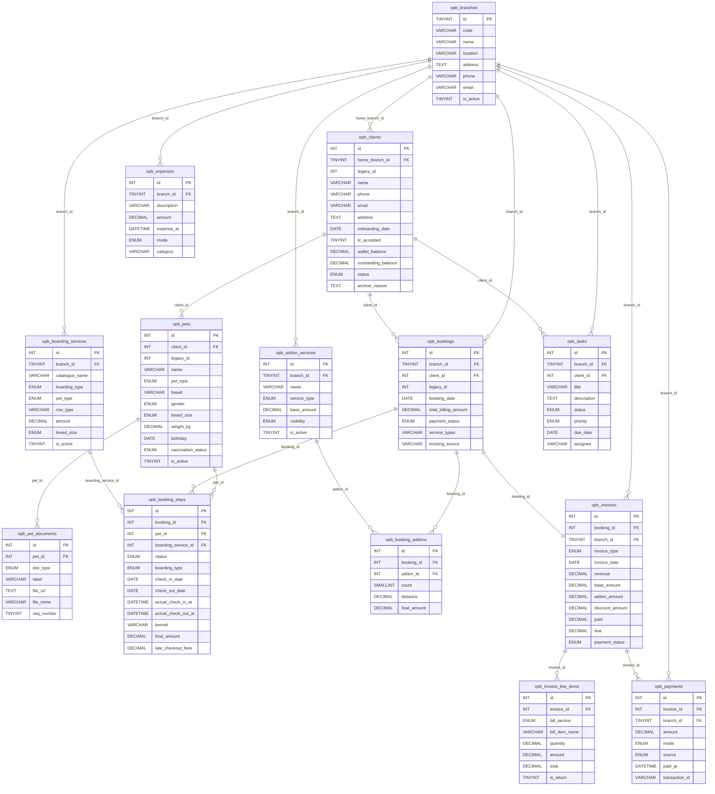

# SYSTEM_SCHEMA.md

Generated from source — `plugin/includes/class-opb-activator.php`, all API controllers, and React routes in `plugin/app/src/App.tsx`.

---

## Table of Contents

1. [Tables](#1-tables)
   - [opb_branches](#opb_branches)
   - [opb_clients](#opb_clients)
   - [opb_pets](#opb_pets)
   - [opb_pet_documents](#opb_pet_documents)
   - [opb_boarding_services](#opb_boarding_services)
   - [opb_addon_services](#opb_addon_services)
   - [opb_bookings](#opb_bookings)
   - [opb_booking_stays](#opb_booking_stays)
   - [opb_booking_addons](#opb_booking_addons)
   - [opb_invoices](#opb_invoices)
   - [opb_invoice_line_items](#opb_invoice_line_items)
   - [opb_payments](#opb_payments)
   - [opb_tasks](#opb_tasks)
   - [opb_expenses](#opb_expenses)
2. [Relationship Tree](#2-relationship-tree)
3. [ER Diagram](#3-er-diagram)
4. [Coverage Gaps](#4-coverage-gaps)

---

## 1. Tables

---

### `opb_branches`

**Purpose:** Represents a physical boarding location (e.g. H2 Succoro, H3 Colvale, H4 Moira). Every branch-scoped record carries a `branch_id` pointing here. The branch selector in the UI controls which branch's data is visible for a given session.

**Primary key:** `id` `TINYINT UNSIGNED AUTO_INCREMENT`

**Foreign keys:** none

| Field | Type | Required | Notes |
|---|---|---|---|
| `code` | `VARCHAR(10)` | ✅ | Unique short identifier, e.g. `H2`. Used by branch resolver and import pipeline. |
| `name` | `VARCHAR(100)` | ✅ | Display name, e.g. `H2 Succoro`. |
| `location` | `VARCHAR(100)` | ✅ | City / locality label. |
| `address` | `TEXT` | — | Full postal address. |
| `phone` | `VARCHAR(20)` | — | Branch contact number. |
| `email` | `VARCHAR(100)` | — | Branch contact email. |
| `is_active` | `TINYINT(1)` | ✅ default `1` | Soft-delete flag. Inactive branches are excluded from selectors. |
| `created_at` | `DATETIME` | auto | Row creation timestamp. |
| `updated_at` | `DATETIME` | auto | Last-modified timestamp (ON UPDATE). |

**Status fields:** `is_active` — `1` active / `0` inactive.

**Creation flow:** Created via Settings → Branches UI or during plugin activation when seeding the three production branches.

---

### `opb_clients`

**Purpose:** A pet owner registered with one home branch. Central entity; almost every other table links back to clients via bookings or directly.

**Primary key:** `id` `INT UNSIGNED AUTO_INCREMENT`

**Foreign keys:**
- `home_branch_id → opb_branches.id`

| Field | Type | Required | Notes |
|---|---|---|---|
| `home_branch_id` | `TINYINT UNSIGNED` | ✅ | Determines which branch-scoped staff can see this client. |
| `name` | `VARCHAR(150)` | ✅ | Full name. |
| `phone` | `VARCHAR(25)` | ✅ | Primary contact; indexed for fast search. |
| `email` | `VARCHAR(150)` | — | Optional email address. |
| `address` | `TEXT` | — | Home address. |
| `local_guardian_name` | `VARCHAR(150)` | — | Emergency contact name. |
| `local_guardian_contact` | `VARCHAR(25)` | — | Emergency contact phone. |
| `onboarding_date` | `DATE` | — | Date the client first registered. |
| `tc_accepted` | `TINYINT(1)` | ✅ default `0` | T&C acceptance flag, sent via WhatsApp onboarding link. |
| `wallet_balance` | `DECIMAL(10,2)` | ✅ default `0.00` | Prepaid credit balance (currently display-only; not yet deducted automatically). |
| `outstanding_balance` | `DECIMAL(10,2)` | ✅ default `0.00` | Aggregated unpaid dues across all invoices. |
| `notes` | `TEXT` | — | Free-form staff notes. |
| `legacy_id` | `INT UNSIGNED` | — | Source ID from the imported legacy SaaS system. |
| `wp_user_id` | `BIGINT UNSIGNED` | — | Optional link to a WordPress user account. |
| `archive_reason` | `TEXT` | — | Required when `status = 'archived'`. |

**Status fields:** `status` — `ENUM('active','archived')`.

**Creation flow:** Clients → New Client form → `POST /opb/v1/clients`. Required: `name`, `phone`, `home_branch_id`. Auto-sets `status = 'active'` and `onboarding_date = today`.

---

### `opb_pets`

**Purpose:** A pet belonging to a client. One client may have many pets. Pets carry detailed health, vaccination, dietary, and walk-schedule profiles used during boarding.

**Primary key:** `id` `INT UNSIGNED AUTO_INCREMENT`

**Foreign keys:**
- `client_id → opb_clients.id`

| Field | Type | Required | Notes |
|---|---|---|---|
| `client_id` | `INT UNSIGNED` | ✅ | Owner. |
| `name` | `VARCHAR(100)` | ✅ | Pet's name. |
| `pet_type` | `ENUM('Dog','Cat','Other')` | ✅ | Drives boarding catalogue filtering. |
| `breed` | `VARCHAR(100)` | — | |
| `gender` | `ENUM('Male','Female','Unknown')` | — | |
| `breed_size` | `ENUM('Small','Medium','Large')` | — | Used in pricing engine. |
| `coat` | `VARCHAR(50)` | — | |
| `weight_kg` | `DECIMAL(5,2)` | — | Recorded at profile and again at check-in / check-out. |
| `birthday` | `DATE` | — | |
| `microchip_number` | `VARCHAR(50)` | — | |
| `neutered_or_spayed` | `TINYINT(1)` | — | |
| `last_heat_month` | `TINYINT UNSIGNED` | — | |
| `last_heat_year` | `SMALLINT UNSIGNED` | — | |
| `adoption_status` | `VARCHAR(50)` | — | |
| `social_media_handle` | `VARCHAR(100)` | — | |
| `consent_photos` | `TINYINT(1)` | — | default `0` |
| `special_occasion` | `VARCHAR(100)` | — | |
| `special_occasion_date` | `DATE` | — | |
| `vaccination_status` | `ENUM('Vaccinated','Not vaccinated','Unknown')` | — | default `'Unknown'` |
| `anti_rabies_date` | `DATE` | — | |
| `dhppil_date` | `DATE` | — | |
| `corona_date` | `DATE` | — | |
| `kennel_cough_date` | `DATE` | — | |
| `tick_prevention` | `TINYINT(1)` | — | default `0` |
| `last_tick_prevention_date` | `DATE` | — | |
| `tick_prevention_method` | `VARCHAR(100)` | — | |
| `ongoing_medication` | `TINYINT(1)` | — | default `0` |
| `medication_detail` | `TEXT` | — | |
| `major_illness_history` | `TEXT` | — | |
| `deworming_date` | `DATE` | — | |
| `vet_name` | `VARCHAR(150)` | — | |
| `vet_contact` | `VARCHAR(25)` | — | |
| `dietary_preference` | `VARCHAR(100)` | — | |
| `additional_meals` | `TEXT` | — | |
| `preferences_or_allergies` | `TEXT` | — | |
| `first_walk_schedule` | `VARCHAR(100)` | — | |
| `second_walk_schedule` | `VARCHAR(100)` | — | |
| `third_walk_schedule` | `VARCHAR(100)` | — | |
| `legacy_id` | `INT UNSIGNED` | — | Source ID from legacy import. |

**Status fields:** `is_active` — `TINYINT(1)`. Soft-delete: inactive pets are excluded from booking creation dropdowns.

**Creation flow:** Client Profile → Add Pet → `POST /opb/v1/clients/{id}/pets`. Required: `name`, `pet_type`.

---

### `opb_pet_documents`

**Purpose:** Files attached to a pet — photos, vaccination certificates, and miscellaneous documents uploaded via the WordPress media library.

**Primary key:** `id` `INT UNSIGNED AUTO_INCREMENT`

**Foreign keys:**
- `pet_id → opb_pets.id`

| Field | Type | Required | Notes |
|---|---|---|---|
| `pet_id` | `INT UNSIGNED` | ✅ | |
| `doc_type` | `ENUM('photo','vaccination','other')` | ✅ | |
| `file_url` | `TEXT` | ✅ | WordPress attachment URL. |
| `label` | `VARCHAR(150)` | — | Human-readable label. |
| `file_mime` | `VARCHAR(100)` | — | MIME type. |
| `seq_number` | `TINYINT UNSIGNED` | ✅ default `1` | Display ordering within a doc_type. |
| `uploaded_by` | `BIGINT UNSIGNED` | — | WordPress user ID of uploader. |
| `created_at` | `DATETIME` | auto | |

**Status fields:** none (rows are hard-deleted via `DELETE /opb/v1/pets/{id}/documents/{doc_id}`).

**Creation flow:** Pet Profile → Documents tab → file upload → `POST /opb/v1/pets/{id}/documents` (multipart). Stored via `media_handle_upload()` into the WordPress media library; URL saved here.

---

### `opb_boarding_services`

**Purpose:** The pricing catalogue for boarding services. Each row represents one pricing rule or tariff tier (e.g. "Overnight — Large Dog — 3+ nights"). The pricing engine reads these rows to build invoice line items at booking creation and check-out.

**Primary key:** `id` `INT UNSIGNED AUTO_INCREMENT`

**Foreign keys:**
- `branch_id → opb_branches.id`

| Field | Type | Required | Notes |
|---|---|---|---|
| `branch_id` | `TINYINT UNSIGNED` | ✅ | Catalogue is branch-specific. |
| `catalogue_name` | `VARCHAR(150)` | ✅ | Groups rows into named catalogues. |
| `boarding_type` | `ENUM('DAY','OVERNIGHT')` | ✅ | |
| `pet_type` | `ENUM('DOG','CAT','ANY')` | ✅ | |
| `row_type` | `VARCHAR(50)` | ✅ | Internal classifier used by pricing engine (e.g. `BASE`, `MEAL`, `ADDON`). |
| `amount` | `DECIMAL(10,2)` | — | Price for this row. |
| `discount_type` | `VARCHAR(50)` | — | |
| `breed_size` | `ENUM('Small','Medium','Large')` | — | |
| `kennel_category` | `VARCHAR(50)` | — | |
| `meal_name` | `VARCHAR(100)` | — | |
| `meal_type` | `VARCHAR(50)` | — | |
| `price_type` | `VARCHAR(50)` | — | |
| `modifies_base_bill` | `TINYINT(1)` | — | default `0` |
| `min_pets` | `TINYINT UNSIGNED` | — | Minimum pets for multi-pet discount trigger. |
| `days` | `SMALLINT UNSIGNED` | — | Minimum nights for long-stay tier. |
| `min_age_months` | `SMALLINT UNSIGNED` | — | |
| `max_age_months` | `SMALLINT UNSIGNED` | — | |
| `breed` | `VARCHAR(100)` | — | |
| `extra_info` | `TEXT` | — | |
| `sort_order` | `SMALLINT UNSIGNED` | ✅ default `0` | Display order in Settings → Boarding. |

**Status fields:** `is_active` — `TINYINT(1)`. Soft-delete only (no physical DELETE).

**Creation flow:** Settings → Boarding Catalogue → `POST /opb/v1/settings/boarding`.

---

### `opb_addon_services`

**Purpose:** Add-on services available at a branch (e.g. transport, grooming, custom meals). These are selected during booking creation and can be added to an active booking at any time.

**Primary key:** `id` `INT UNSIGNED AUTO_INCREMENT`

**Foreign keys:**
- `branch_id → opb_branches.id`

| Field | Type | Required | Notes |
|---|---|---|---|
| `branch_id` | `TINYINT UNSIGNED` | ✅ | |
| `name` | `VARCHAR(100)` | ✅ | |
| `description` | `TEXT` | — | |
| `service_type` | `ENUM('FLAT','DISTANCE_SLAB')` | ✅ default `'FLAT'` | `DISTANCE_SLAB` enables tiered transport pricing by km. |
| `base_amount` | `DECIMAL(10,2)` | ✅ default `0.00` | |
| `visibility` | `ENUM('PUBLIC','PRIVATE')` | ✅ default `'PUBLIC'` | `PRIVATE` items are not shown in client-facing contexts. |
| `applicable_services` | `TEXT` | — | Comma-separated boarding types this add-on applies to. |
| `distance_up_to` | `DECIMAL(8,2)` | — | Distance threshold for slab pricing. |
| `distance_slab_amount` | `DECIMAL(10,2)` | — | Amount above threshold distance. |
| `sort_order` | `SMALLINT UNSIGNED` | ✅ default `0` | |

**Status fields:** `is_active` — `TINYINT(1)`.

**Creation flow:** Settings → Add-on Catalogue → `POST /opb/v1/settings/addons`.

---

### `opb_bookings`

**Purpose:** The header record for a boarding reservation. One booking per visit, regardless of the number of pets. Stays, add-ons, and the invoice all hang off this record.

**Primary key:** `id` `INT UNSIGNED AUTO_INCREMENT`

**Foreign keys:**
- `branch_id → opb_branches.id`
- `client_id → opb_clients.id`
- `created_by → wp_users.ID` (WordPress, not a custom table)

| Field | Type | Required | Notes |
|---|---|---|---|
| `branch_id` | `TINYINT UNSIGNED` | ✅ | |
| `client_id` | `INT UNSIGNED` | ✅ | |
| `booking_date` | `DATE` | ✅ | Date the booking was made (not necessarily check-in date). |
| `service_types` | `VARCHAR(100)` | — | Human label for the mix of services (e.g. `Overnight, Daycare`). |
| `booking_source` | `VARCHAR(100)` | — | How the booking was acquired (e.g. `WhatsApp`, `Walk-in`). |
| `notes` | `TEXT` | — | Internal notes. |
| `additional_instruction` | `TEXT` | — | Special care instructions from client. |
| `total_billing_amount` | `DECIMAL(10,2)` | ✅ default `0.00` | Denormalised total, kept in sync with invoice. |
| `legacy_id` | `INT UNSIGNED` | — | Source ID from legacy import. |

**Status fields:** `payment_status` — `ENUM('Unpaid','Partially paid','Paid','Overpaid','No bill')`. Mirrored from the linked invoice; updated by `OPB_Invoice_Generator::sync_payment_totals()`.

**Creation flow:** Bookings → New Booking → `POST /opb/v1/bookings`. Required: `client_id`, `branch_id`, `stays[]` (at least one stay). Auto-creates an invoice via `OPB_Invoice_Generator::create_for_booking()`.

---

### `opb_booking_stays`

**Purpose:** One row per pet per stay within a booking. A booking with three pets has three stay rows. Records the full lifecycle: Upcoming → Active (checked in) → Completed (checked out). Drives the occupancy board and check-in/check-out workflows.

**Primary key:** `id` `INT UNSIGNED AUTO_INCREMENT`

**Foreign keys:**
- `booking_id → opb_bookings.id`
- `pet_id → opb_pets.id`
- `boarding_service_id → opb_boarding_services.id`

| Field | Type | Required | Notes |
|---|---|---|---|
| `booking_id` | `INT UNSIGNED` | ✅ | |
| `pet_id` | `INT UNSIGNED` | ✅ | |
| `boarding_service_id` | `INT UNSIGNED` | — | The catalogue row used to price this stay. |
| `boarding_type` | `ENUM('DAY','OVERNIGHT')` | ✅ | |
| `check_in_date` | `DATE` | ✅ | Planned check-in date. |
| `check_out_date` | `DATE` | ✅ | Planned check-out date. |
| `actual_check_in_at` | `DATETIME` | — | Set on check-in action. |
| `actual_check_out_at` | `DATETIME` | — | Set on check-out action. |
| `check_in_slot` | `VARCHAR(50)` | — | Time slot label (e.g. `Morning`). |
| `check_out_slot` | `VARCHAR(50)` | — | |
| `kennel` | `VARCHAR(50)` | — | Kennel identifier assigned at check-in. |
| `meal_type` | `ENUM('BOARDING_MEALS','PARENT_SUPPLIED_MEAL')` | — | |
| `weight_at_checkin` | `DECIMAL(5,2)` | — | |
| `weight_at_checkout` | `DECIMAL(5,2)` | — | |
| `final_amount` | `DECIMAL(10,2)` | — | Computed by pricing engine. |
| `late_checkout_fees` | `DECIMAL(10,2)` | ✅ default `0.00` | Applied at check-out if applicable. |
| `refund_amount` | `DECIMAL(10,2)` | ✅ default `0.00` | |
| `refund_reason` | `TEXT` | — | |
| `companion_name` | `VARCHAR(150)` | — | Person dropping off / picking up. |
| `companion_phone` | `VARCHAR(25)` | — | |
| `notes` | `TEXT` | — | |

**Status fields:** `status` — `ENUM('Upcoming','Active','Completed','No show')`.

**Creation flow:** Created as part of `POST /opb/v1/bookings` (in the `stays[]` array). Updated via `POST /opb/v1/bookings/{id}/checkin` and `POST /opb/v1/bookings/{id}/checkout`.

---

### `opb_booking_addons`

**Purpose:** Junction table linking add-on services to a booking. Stores quantity, optional distance (for transport slabs), computed amount, and notes for each selected add-on.

**Primary key:** `id` `INT UNSIGNED AUTO_INCREMENT`

**Foreign keys:**
- `booking_id → opb_bookings.id`
- `addon_id → opb_addon_services.id`

| Field | Type | Required | Notes |
|---|---|---|---|
| `booking_id` | `INT UNSIGNED` | ✅ | |
| `addon_id` | `INT UNSIGNED` | ✅ | |
| `count` | `SMALLINT UNSIGNED` | ✅ default `1` | Number of units. |
| `distance` | `DECIMAL(8,2)` | — | For `DISTANCE_SLAB` add-ons. |
| `days` | `SMALLINT UNSIGNED` | — | Optional day count multiplier. |
| `final_amount` | `DECIMAL(10,2)` | — | Computed at creation; recalculated when invoice is recalculated. |
| `notes` | `TEXT` | — | |

**Status fields:** none (hard-deleted via `DELETE /opb/v1/bookings/{id}/addons`).

**Creation flow:** Part of booking creation payload (`addons[]`) or added post-creation via `POST /opb/v1/bookings/{id}/addons`. Triggers `OPB_Invoice_Generator::recalculate()`.

---

### `opb_invoices`

**Purpose:** One invoice per booking. Generated automatically at booking creation. Stores computed financial totals as denormalised columns that are kept in sync by `OPB_Invoice_Generator` on every mutation (add-on, payment, check-out, manual adjustment).

**Primary key:** `id` `INT UNSIGNED AUTO_INCREMENT`

**Foreign keys:**
- `booking_id → opb_bookings.id`
- `branch_id → opb_branches.id`

| Field | Type | Required | Notes |
|---|---|---|---|
| `booking_id` | `INT UNSIGNED` | ✅ | One-to-one with bookings. |
| `branch_id` | `TINYINT UNSIGNED` | ✅ | Denormalised from booking for reporting efficiency. |
| `invoice_type` | `ENUM('Booking','Manual')` | ✅ default `'Booking'` | |
| `invoice_date` | `DATE` | ✅ | |
| `revenue` | `DECIMAL(10,2)` | ✅ default `0.00` | Net total after discounts. |
| `base_amount` | `DECIMAL(10,2)` | ✅ default `0.00` | Sum of Base line items. |
| `addon_amount` | `DECIMAL(10,2)` | ✅ default `0.00` | Sum of Add-on line items. |
| `discount_amount` | `DECIMAL(10,2)` | ✅ default `0.00` | Sum of Discount line items (absolute value). |
| `additional_amount` | `DECIMAL(10,2)` | ✅ default `0.00` | Sum of Additional line items. |
| `additional_discount_amount` | `DECIMAL(10,2)` | ✅ default `0.00` | |
| `paid` | `DECIMAL(10,2)` | ✅ default `0.00` | Sum of recorded payments. |
| `due` | `DECIMAL(10,2)` | ✅ default `0.00` | `revenue - paid`. |
| `payment_mode` | `VARCHAR(50)` | — | Last-used payment mode label. |
| `notes` | `TEXT` | — | |
| `legacy_invoice_number` | `VARCHAR(50)` | — | Original invoice number from legacy system. |

**Status fields:** `payment_status` — `ENUM('Unpaid','Partially paid','Paid','Overpaid','No bill')`. Resolved by `OPB_Invoice_Generator::resolve_payment_status()` based on `revenue` vs `paid`.

**Creation flow:** Auto-created by `OPB_Invoice_Generator::create_for_booking()` when a booking is saved. Not created directly via the UI.

---

### `opb_invoice_line_items`

**Purpose:** Itemised breakdown of an invoice. Each pricing action (stay base rate, add-on, discount, manual adjustment) appends one or more rows here. The invoice totals are derived by summing these rows, grouped by `bill_section`.

**Primary key:** `id` `INT UNSIGNED AUTO_INCREMENT`

**Foreign keys:**
- `invoice_id → opb_invoices.id`

| Field | Type | Required | Notes |
|---|---|---|---|
| `invoice_id` | `INT UNSIGNED` | ✅ | |
| `bill_section` | `ENUM('Base','Add-on','Discount','Additional')` | ✅ default `'Base'` | Groups rows in the UI breakdown. |
| `service` | `VARCHAR(150)` | — | Friendly service name. |
| `sku` | `VARCHAR(100)` | — | |
| `sku_id` | `VARCHAR(100)` | — | |
| `category` | `VARCHAR(100)` | — | |
| `sub_category` | `VARCHAR(100)` | — | |
| `bill_item_name` | `VARCHAR(150)` | — | Display label. |
| `quantity` | `DECIMAL(10,2)` | ✅ default `1.00` | |
| `amount` | `DECIMAL(10,2)` | ✅ default `0.00` | Unit price. |
| `discount` | `DECIMAL(10,2)` | ✅ default `0.00` | |
| `subtotal` | `DECIMAL(10,2)` | ✅ default `0.00` | |
| `total` | `DECIMAL(10,2)` | ✅ default `0.00` | `(amount * quantity) - discount`. |
| `is_return` | `TINYINT(1)` | ✅ default `0` | `1` for discount/credit rows. |
| `breed` | `VARCHAR(100)` | — | Pricing-context metadata. |
| `breed_size` | `VARCHAR(50)` | — | |
| `coat_length` | `VARCHAR(50)` | — | |
| `staff_name` | `VARCHAR(150)` | — | |
| `hsn_sac_code` | `VARCHAR(20)` | — | GST classification code. |

**Status fields:** none.

**Creation flow:** Written exclusively by `OPB_Invoice_Generator` (PHP, server-side). Not user-created directly. Manual adjustment rows are created via `PUT /opb/v1/invoices/{id}/adjust`.

---

### `opb_payments`

**Purpose:** Records a payment applied against an invoice. Multiple partial payments are supported. Each payment immediately triggers recalculation of the invoice's `paid`, `due`, and `payment_status` fields.

**Primary key:** `id` `INT UNSIGNED AUTO_INCREMENT`

**Foreign keys:**
- `invoice_id → opb_invoices.id`
- `branch_id → opb_branches.id` (denormalised from invoice)
- `recorded_by → wp_users.ID`

| Field | Type | Required | Notes |
|---|---|---|---|
| `invoice_id` | `INT UNSIGNED` | ✅ | |
| `branch_id` | `TINYINT UNSIGNED` | ✅ | Denormalised for branch-scoped payment reports. |
| `amount` | `DECIMAL(10,2)` | ✅ | Must be > 0. |
| `mode` | `ENUM('Cash','UPI','Other')` | ✅ default `'Cash'` | |
| `source` | `ENUM('Manual','Online')` | ✅ default `'Manual'` | |
| `paid_at` | `DATETIME` | ✅ default `NOW()` | |
| `transaction_id` | `VARCHAR(100)` | — | Reference number for UPI / online payments. |
| `recorded_by` | `BIGINT UNSIGNED` | — | WordPress user who recorded the payment. |
| `notes` | `TEXT` | — | |

**Status fields:** none (deleted via `DELETE /opb/v1/payments/{id}` which triggers recalculation).

**Creation flow:** Invoice Detail → Record Payment → `POST /opb/v1/invoices/{id}/payments`. Triggers `OPB_Invoice_Generator::sync_payment_totals()`.

---

### `opb_tasks`

**Purpose:** Branch-level task management. Tasks can be linked to a specific client or left general. Ordered by priority then due date in all list views.

**Primary key:** `id` `INT UNSIGNED AUTO_INCREMENT`

**Foreign keys:**
- `branch_id → opb_branches.id`
- `client_id → opb_clients.id` (optional)

| Field | Type | Required | Notes |
|---|---|---|---|
| `branch_id` | `TINYINT UNSIGNED` | ✅ | |
| `title` | `VARCHAR(250)` | ✅ | |
| `client_id` | `INT UNSIGNED` | — | Optional client linkage. |
| `description` | `TEXT` | — | |
| `due_date` | `DATE` | — | |
| `assignee` | `VARCHAR(150)` | — | Free-text staff name. |
| `assigned_by` | `VARCHAR(150)` | — | Display name of the creator, set server-side. |
| `comments` | `TEXT` | — | Append-only comment thread (free text). |

**Status fields:** `status` — `ENUM('Open','In Progress','Done')`. `priority` — `ENUM('Low','Medium','High')`.

**Creation flow:** Tasks page → New Task → `POST /opb/v1/tasks`. Required: `title`, `branch_id`.

---

### `opb_expenses`

**Purpose:** Branch operating expenses. Used in the Reports screen to calculate net profit (revenue minus expenses) over a date range, and to break down spend by category.

**Primary key:** `id` `INT UNSIGNED AUTO_INCREMENT`

**Foreign keys:**
- `branch_id → opb_branches.id`
- `recorded_by → wp_users.ID`

| Field | Type | Required | Notes |
|---|---|---|---|
| `branch_id` | `TINYINT UNSIGNED` | ✅ | |
| `description` | `VARCHAR(250)` | ✅ | Short label for the expense. |
| `amount` | `DECIMAL(10,2)` | ✅ | |
| `expense_at` | `DATETIME` | ✅ default `NOW()` | When the expense was incurred. |
| `mode` | `ENUM('Cash','UPI','Other')` | ✅ default `'Cash'` | |
| `category` | `VARCHAR(100)` | — | Free-text category used in Reports breakdown. |
| `amount_inc_tax` | `DECIMAL(10,2)` | — | Tax-inclusive amount, if different. |
| `recorded_by` | `BIGINT UNSIGNED` | — | |
| `notes` | `TEXT` | — | |

**Status fields:** none.

**Creation flow:** Expenses page → Add Expense → `POST /opb/v1/expenses`.

---

## 2. Relationship Tree

```
opb_branches (H2, H3, H4)
├── opb_clients           [home_branch_id]
│   └── opb_pets          [client_id]
│       ├── opb_pet_documents     [pet_id]
│       └── opb_booking_stays     [pet_id]  ← also reached via bookings
└── opb_bookings          [branch_id + client_id]
    ├── opb_booking_stays [booking_id]
    │   └── opb_boarding_services [boarding_service_id]
    ├── opb_booking_addons[booking_id]
    │   └── opb_addon_services    [addon_id]
    └── opb_invoices      [booking_id]  (one-to-one)
        ├── opb_invoice_line_items[invoice_id]
        └── opb_payments          [invoice_id]

opb_tasks                 [branch_id, client_id?]
opb_expenses              [branch_id]
```

---

## 3. ER Diagram



---

## 4. Coverage Gaps

### Tables not currently exposed in the UI

| Table | Reason |
|---|---|
| `opb_invoice_line_items` | Read-only. Displayed within Invoice Detail as a breakdown list, but there is no screen to create, edit, or delete individual line items. Mutations happen via `OPB_Invoice_Generator` (server-side) or the manual adjustment endpoint (`PUT /invoices/{id}/adjust`). |
| `opb_booking_addons` | Managed inline within Booking Detail — no standalone list, search, or management screen. |

### UI pages that have no corresponding table

| Route | Component | Notes |
|---|---|---|
| `/` | `Dashboard` | Aggregates live data across `booking_stays`, `invoices`, `tasks`. No own table. |
| `/kennel` | `OccupancyBoard` | Date-range grid view built from `opb_booking_stays` + kennel field. No own table. |
| `/reports` | `Reports` | Aggregated analytics across `invoices`, `expenses`, `booking_stays`. No own table. |
| `/import` | `Import` | Drives the CSV/XLSX import pipeline. No own table; writes into the standard entity tables. |
| `/settings` | `Settings` | Landing/hub page. Redirects to sub-pages. No own table. |
| `/settings/staff` | `Staff` | Reads/writes WordPress `wp_users` and `wp_usermeta` (roles, `opb_branch_id`). Not a custom table. |

### Tables with no CRUD screens

| Table | Current state | Missing |
|---|---|---|
| `opb_pet_documents` | Upload (POST) and delete (DELETE) exposed via Pet Profile → Documents tab. No standalone document list or bulk management screen. | Standalone documents list; bulk operations (reorder, re-label, replace). |
| `opb_invoice_line_items` | Display-only within Invoice Detail. Server-generated. | No write UI planned (by design); manual adjustments go through the adjustment endpoint. |
| `opb_booking_addons` | Add/remove within Booking Detail. No list, no edit-in-place. | Edit quantity / amount on existing add-on rows. |
| `opb_boarding_services` | Full CRUD via Settings → Boarding Catalogue. | — (covered) |
| `opb_addon_services` | Full CRUD via Settings → Add-on Catalogue. | — (covered) |
| `opb_branches` | Full CRUD via Settings → Branches. | — (covered) |
